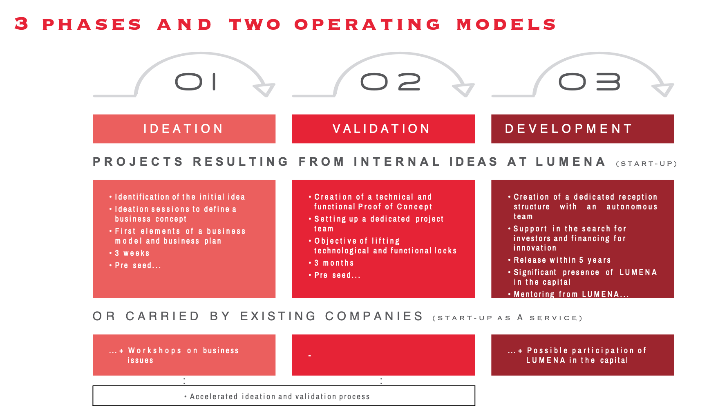

# General Grant Proposal

* **Project:** *Delmonicos*

## Project Overview :page_facing_up: 
The solution we are building is aimed to solve the following problems that Electric Vehicules owners and energy providers are already facing :
* **Interoperability** : today it's common for EV owner to have multiple (4 or 5) cards dedicated to the connection of charging networks.
  Nevertheless, it's also common not to be able to charge despite having so many cards and subscriptions.
* **Costs** : Standard payment networks are often too expensive for payments below few euros or dollars.
* **Flexibility** : today, handling complex payment scheme (for exemple, reimboursing people who charge at home when the vehicule electricity is paid by the employer)
  is a real issue and often a good reason enough not to choose EV for company car. 

### Overview

The goals of the project is to develop and deploy an infrastructure dedicated to the supervision of charging station, strongly coupled 
with a micro-payment infrastructure. The technical requirements of the solution are the following :
* It must be very **secure**. Especially, only allowed people and computers should be able to interact with charging stations.
  Payments must fulfill latests security constraints especially regarding DSP2.
* It must be as **cheap** as possible to operate. The challenge is to meet the security requirements without having additonal costs or
  having to rely on external third-party.
* It must be **easy to deploy**. 
* It must be **easily extensible**. Other parties should be able to join the networks without compromising the security of the infrastructure. 

Taking into account the above-mentioned constraints, we have chosen to base our solution on blockchain technology, for the following reasons :
* It is secure by design and **quasi impossible to hack** if carefully used and implemented.
* It allows **strong authentication** through the use of wallets
* It allows **secured delivery versus payment**. Each payment can be related to a dedicated delivery of service and the proofs of the delivery can
  be stored in case of dispute.
* The **trustless** nature of the technology allows adding new network participants without compromising the security of other participants. 
* The deployment can be easy and secured if **each charging station is also a network node**. 

The reasons why we chose Substrate/Polkadot are :
* By having nodes with a dedicated purpose, we will be able to optimise the footprint of the node in order to deploy it to charging stations, 
  that have limited available resources
* We can choose the most suitable consensus mechanism and especially combine POA on the parachain with PoS on the relay chain. 
* We have the flexibility to chose between multiple target topologies. E.g. one parachain for all energy providers on the platform, or one parachain by 
  energy provider.
* The composability of the FRAME architecture allows us to reuse existing pallets (e.g. identity, membership, contracts, ...) while being able to add
  our own specific pallets. 
* Since we have connections to multiple interfaces (payments, charging power, mobile apps) the offchain features of Substrate will alllow us to handle 
  the connection with external sources in both directions in a secure manner. 
 
Lumena is creating this project because it is a startup studio focused on innovative technologies and especially blockchain. Our goal is to create new generation of services
in collaboration with industry partners. We have a well structured process in order to decide if we create a company or not. The followingschema details this process :

For Delmonicos, we are currently in phase two where we have to develop a POC of the platform, in order to address risks and to show the feasibility of the project. 
If we can fund this phase and if the results are positive, we'll create a company dedicated to develop and sell the platform.
We are applying for the 30k$ Open Grant Program from w3f that will definitely allow us to do these two phases. 

### Project Details 
We expect the teams to already have a solid idea about the project's expected final state.

Therefore, we ask the teams to submit (where relevant):
* Mockups/designs of any UI components
* API specifications of the core functionality
* An overview of the technology stack to be used
* Documentation of core components, protocols, architecture etc. to be deployed
* PoC/MVP or other relevant prior work or research on the topic

### Ecosystem Fit 
Are there any other projects similar to yours? If so, how is your project different?

## Team :busts_in_silhouette:

### Team members
* Fabrice CROISEAUX
* Michel ONFRAY
* Antoine DETANTE
* Franck LEGARDEUR

### Team Website	
* https://lumena.tech

### Legal Structure 
Please provide the name and registered address of the legal entity executing the project. When applying via the General Grants program, these details can also be shared privately via the Google Form used for your application.

### Team's experience
Please describe the* team's relevant experience.  If the project involves development work, then we'd appreciated if you can single out a few interesting code commits made by team members on their past projects. For research-related grants, references to past publications and projects in a related domain are helpful.  

### Team Code Repos
* https://github.com/lumena-tech/delmonico

### Team LinkedIn Profiles
* https://www.linkedin.com/in/fcroiseaux
* https://www.linkedin.com/in/michel-onfray-464918b7/
* https://www.linkedin.com/in/adetante/
* https://www.linkedin.com/in/franck-legardeur-a05577/

## Development Roadmap :nut_and_bolt: 

This section should break out the development roadmap into a number of milestones. Since the milestones will appear in the grant contract, it helps to describe the functionality we should expect, plus how we can check that such functionality exists in the product. Whenever milestones are delivered, we refer to the contract to ensure that everything has been delivered as expected.

Below we provide an **example roadmap**. In the descriptions it should be clear how the project is related to Substrate and/or Polkadot. We recommend that the scope of the work can fit within a 3 month period and that teams structure their roadmap as 1 month = 1 milestone. 

For each milestone:
* Please be sure to include a specification of the software. The level of detail must be enough so that we are able to verify that the software meets the specification.
* Please include total amount of funding requested per milestone.
* Please note that we require documentation (e.g. tutorials, API specifications, architecture details) in each milestone. This ensures that the code can be widely used by the community.
* Please provide a test suite, comprising unit and integration tests, along with a guide on how to run these.
* Please commit to providing a dockerfiles for the delivery of your project. 
* Please indicate the milestone duration, as well as number of Full-Time Employees working on each milestone, and include the number of days along with their cost per day.

### Overview
* **Total Estimated Duration:** Duration of the whole project
* **Full-time equivalent (FTE):**  Workload of an employed person ([see](https://en.wikipedia.org/wiki/Full-time_equivalent)) 
* **Total Costs:** Amount of Payment for the whole project. The total amount of funding needs to be below $100k.

### Milestone 1 Example — Implement Substrate Modules 
* **Estimated Duration:** 1 month
* **FTE:**  1
* **Costs:** $5,000

| Number | Deliverable | Specification |
| ------------- | ------------- | ------------- |
| 0a. | License | Apache 2.0 / MIT / Unlicense |
| 0b. | Documentation | We will provide both inline documentation of the code and a basic tutorial that explains how a user can (for example) spin up one of our Substrate nodes. Once the node is up, it will be possible to send test transactions that will show how the new functionality works. |
| 0c. | Testing Guide | The code will have proper unit-test coverage (e.g. 90%) to ensure functionality and robustness. In the guide we will describe how to run these tests | 
| 1. | Substrate module: X | We will create a Substrate module that will... (Please list the functionality that will be coded for the first milestone) |  
| 2. | Substrate module: Y | We will create a Substrate module that will... |  
| 3. | Substrate module: Z | We will create a Substrate module that will... |  
| 4. | Substrate chain | Modules X, Y & Z of our custom chain will interact in such a way... (Please describe the deliverable here as detailed as possible) |  
| 5. | Docker | We will provide a dockerfile to demonstrate the full functionality of our chain |

### Milestone 2 Example — Additional features
...

### Community engagement

As part of the Program, we require that you produce an article/tutorial and publish it (for example on [Medium](https://medium.com/)). It should explain your work done as part of the grant. 

Normally, we ask you to submit the write-up upon the completion of your grant, although for larger projects it might make sense to publish multiple articles after the completion of different milestones.

## Future Plans
Please include the team's long-term plans and intentions.

## Additional Information :heavy_plus_sign: 
Any additional information that you think is relevant to this application that hasn't already been included.

Possible additional information to include:
* What work has been done so far?
* Are there are any teams who have already contributed (financially) to the project?
* Have you applied for other grants so far?
